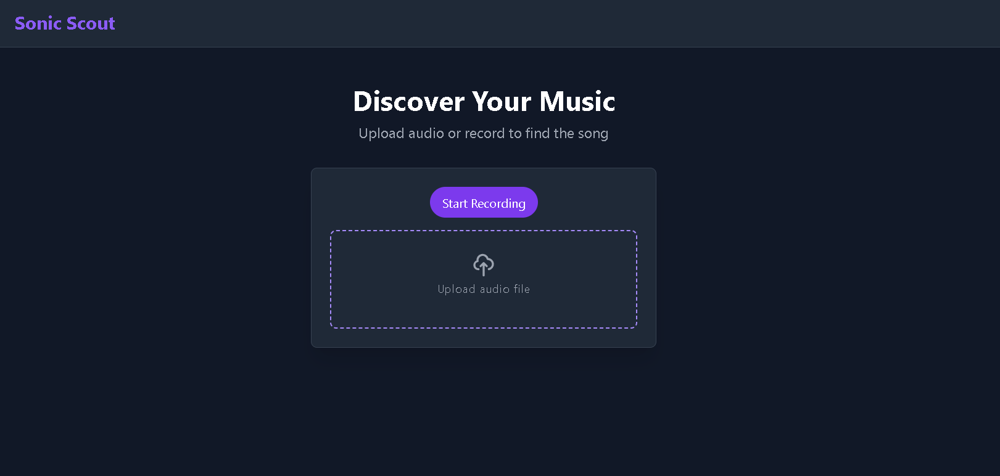
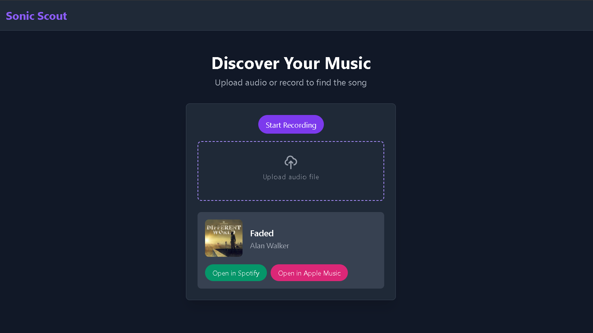

# Sonic Source 🎵

**Sonic Source** is a web application that allows users to find song titles based on uploaded video files. The app displays relevant song titles, artist names, and links to Spotify and Apple Music. 

> **Status: Beta**  
> The voice recognition feature is currently in beta. Users can use this feature to search for songs, but the accuracy might not be optimal.

## Key Features 🌟
- **Song Search**: Users can upload a video file and get relevant song information.
- **Song Details**: Each search result displays:
  - Song Title
  - Artist Name
  - Links to **Spotify** and **Apple Music**
- **Beta Feature - Voice Recognition**: Song search based on video audio is still in development. Accuracy will continue to improve.

## How to Use 🛠️

1. **Upload Video File**: Select a video file from your device.
2. **Search Process**: The app will process the file to identify the song within it.
3. **Search Results**: You will receive:
   - The relevant song title.
   - The artist name.
   - Links to Spotify and Apple Music to listen to the song.

## Technologies Used 🧰

- **Laravel, Vue**

## Initial Screen 🖼️

### Search Results:
